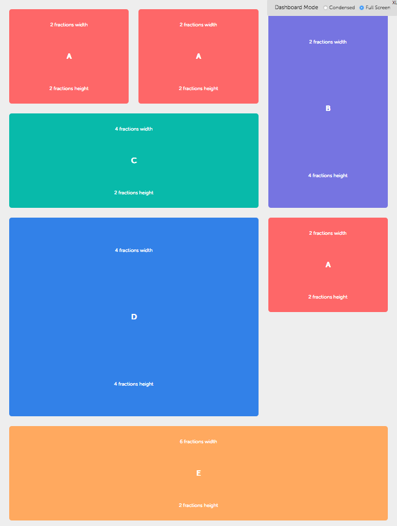
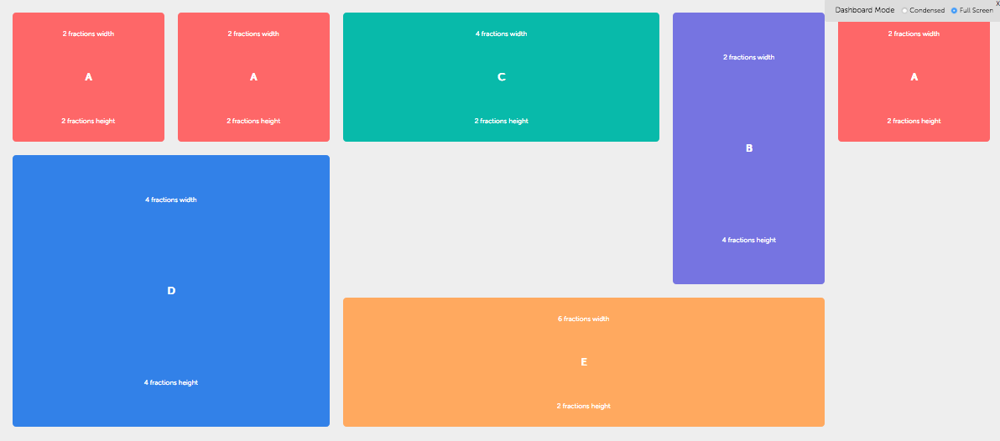
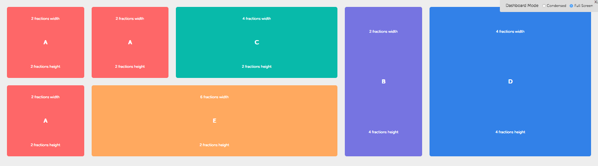

# Dashboard

Project implementing all the necessary proofs of concept for the new Morpheus Dashboard.

<br>

## Concepts and Requirements

- The Dashboard must **contain a list of widgets**.
- The widgets must be **displayed in a grid format**.
- The Dashboard can assume one of three different sizes:
  - **Condensed**: Fixed to the bottom of the browser window, with a fixed height and full width. This view does not have any scroll behavior but it must follow the widgets order established on the other views.
  - **Expanded**: Fixed to the bottom of the browser window, with 4 widget fractions height. Widgets heights must be 2 fractions maximum. Widgets must be responsive and respond to the minimum height, adjusting their sizes and display accordingly. If the existing widgets inside the container consume more than the available space, the remaining widgets must be placed to the right and an horizontal scroll must occur.
  - **Full Screen**: Covers the entire browser window. If the existing widgets inside the container consume more than the available space, the remaining widgets must be placed below the existing ones and a vertical scroll must occur.
- The Dashboard **grid must be responsive**, as well as the widgets inside it.
- The Dashboard grid must **allow widget reordering**, either by dragging and dropping or by manually defining the widget positions.
- The widget reordering and consequent **repositioning movement must be animated**.

Further requirements, not implemented yet:
- The Dashboard must **allow adding new widgets by dragging and dropping** them into a magnetic field **or by clicking an "Add to Dashboard" button in the widget** (from quick view).
- The Dashboard must **allow removing existing widgets by dragging and dropping** them into a widget removal drop zone **or by clicking a remove button** in the widget.
- **Widgets can be redimensioned**, either by adjusting the number of columns they occupy in the grid (+N columns) or rows (+M rows).

The following examples illustrate the grid layout:

<br>

#### Grid Layout - Example 1
<div style="text-align: center;">
    
</div>

<br>

#### Grid Layout - Example 2
<div style="text-align: center;">
    
</div>

<br>

#### Grid Layout - Example 3
<div style="text-align: center;">
    
</div>

<br>

## Technical Solutions

### Grid

To implement a grid layout inside the Dashboard we opted for using the **CSS Grid Layout**. This choice was due to the grid responsive nature, as well as being native to the browsers. By using native browser mechanisms we ensure very high levels of performance, even in older devices.

We also chose the CSS Grid because most of our target browsers implement it, with the exception of Internet Explorer 11. According to the website [http://caniuse.com](http://caniuse.com), Internet Explorer 11 only implements the CSS Grid specification partially ([https://caniuse.com/#feat=css-grid](https://caniuse.com/#feat=css-grid)) and only a very old version of it ([https://www.w3.org/TR/2011/WD-css3-grid-layout-20110407/](https://www.w3.org/TR/2011/WD-css3-grid-layout-20110407/)), previous to the first official W3C specification. For this reason, we implemented fallbacks to handle those limitations.

#### Internet Explorer 11 Fallbacks

To ensure the best compatibility with the latest CSS Grid implementation, we have added an intermediate container `dashboard-ie-fallback`. Through this container we are able to define rules and prefixes to be applied specifically to Internet Explorer 11.

##### HTML

```html
<div id="container1" class="dashboard">
    <div class="dashboard-ie-fallback">

        <div class="dashboard-item">
            <div class="dashboard-item-content">A</div>
        </div>

        <div class="dashboard-item">
            <div class="dashboard-item-content">B</div>
        </div>

        ...

    </div>
</div>
```

##### CSS

```css
.dashboard-ie-fallback {

    ...

    display: grid;

    ...

    @media all and (-ms-high-contrast: none), (-ms-high-contrast: active) {
        display: flex;
        flex-direction: row;
        flex-wrap: wrap;
        flex: auto;
    }
}

...

.dashboard-item {

    ...

    order: 9999999;

    ...

    @media all and (-ms-high-contrast: none), (-ms-high-contrast: active) {
        margin: 16px;
        display: block;
        width: 100px;
        height: auto;
        flex-grow: 1;
    }
}
```

<br>

### Drag and Drop

To implement the drag and drop functionality we chose to use a mouse cursor tracking technique. We opted for this technique over the HTML5 `draggable` element capabilities, due to its limitations. Although being native, the HTML5 item dragging functionality creates a rough image copy of the element being dragged, not allowing any type of styling or further manipulation over it.

Since we need to fully manipulate the element being dragged (and be able to style it differently while dragging), we track the mouse movement. When the user performs a long mouse press, we check for the element being clicked underneath it. If the element clicked is a widget, we drag it around. The dragging ends when the user releases the mouse button.

The following functions prototypes demonstrate the technique:

##### Javascript

```javascript
/*
 * Function responsible for dragging an HTML element.
 * @param {HTMLElement} elem - The element to be dragged.
 */
function dragElement(elem) {

    /**
     * Function responsible to setup the element dragging when the mouse starts clicking the element.
     * @param {Event} e Mouse movement event.
     */
    function dragMouseDown(e) { ... }

    /**
     * Function responsible to drag the element when the mouse is clicking the it.
     * @param {Event} e Mouse movement event.
     */
    function elementDrag(e) { ... }

    /**
     * Function responsible to stop dragging an element when the mouse button is released.
     */
    function closeDragElement() { ... }

    elem.onmousedown = dragMouseDown;
}

// Dashboard items inside the container
var dashboardItems = document.getElementsByClassName('dashboard-item');
// Enable Drag and Drop capabilities on all internal items (the ones inside the Dashboard)
[].forEach.call(dashboardItems, function (dashboardItem) {
    dragElement(dashboardItem);
});

// Dashboard items outside the container
var externalDashboardItems = document.getElementsByClassName('external-dashboard-item');
// Enable Drag and Drop capabilities on all external dashboard items (the ones to be dragged and dropped inside the Dashboard)
[].forEach.call(externalDashboardItems, function (externalDashboardItem) {
    dragElement(externalDashboardItem);
});

```

This technique was found on the "Draggable Div Element(s) - [https://codepen.io/andreros/pen/gdajaV](https://codepen.io/andreros/pen/gdajaV)" example.

<br>

### The Dashboard

To accomplish the pretended modes for the Dashboard, the following modifier classes are available:

| Class | Description |
|---|---|
| `dashboard` | The root class for the Dashboard. |
| `dashboard--condensed` | The modifier class to set the Dashboard to condensed mode. |
| `dashboard--expanded` | The modifier class to set the Dashboard to expanded mode. |
| `dashboard--full-screen` | The modifier class to set the Dashboard to full screen mode. |

These classes must be applied to the `dashboard` element:

```HTML
<!-- Dashboard in 'condensed' mode -->
<div id="container1" class="dashboard dashboard--condensed">
    <div class="dashboard-ie-fallback">
        <!-- dashboard items go here -->
    </div>
</div>

<!-- Dashboard in 'expanded' mode -->
<div id="container1" class="dashboard dashboard--expanded">
    <div class="dashboard-ie-fallback">
        <!-- dashboard items go here -->
    </div>
</div>

<!-- Dashboard in 'full screen' mode -->
<div id="container1" class="dashboard dashboard--full-screen">
    <div class="dashboard-ie-fallback">
        <!-- dashboard items go here -->
    </div>
</div>
```

<br/>

### The Dashboard Items

The class `dashboard-item` implements the necessary rules to control a Dashboard item. The item structure is the following:

##### HTML

```html
<div class="dashboard-item">
    <div class="dashboard-item-content">A</div>
</div>
```

<br/>

### Ordering Animation

To implement widget animation when ordering widget positions inside the Dashboard, we recur to a technique where we create a "ghost" element to wrap the widget itself. The "ghost" wrapper element is controlled by the class `dashboard-item`. Since the "ghost" wrapper element is a direct child of the CSS Grid container (the Dashboard), as soon as we manipulate its CSS `order` property, the grid repositions the "ghost" automatically.

With the "ghost" wrapper element repositioned, we apply the animation to its content, controlled by the class `dashboard-item-content`, through javascript, instructing it to place itself exactly on top of its parent container again (the "ghost" wrapper element).


##### CSS

```CSS
/* the "ghost" wrapper element */
.dashboard-item {
    min-height: 100px;
    height: 100%;
    order: 9999999;
    outline: dashed 1px rgba(255, 0, 0, 0.5);
}

/* the Dashboard item content */
.dashboard-item-content {
    display: flex;
    flex-direction: column;
    align-items: center;
    justify-content: space-around;
    font-weight: 700;
    font-size: 48px;
    border-radius: 10px;
    background-color: #aaa;
    position: absolute;
    left: 0;
    top: 0;
    transition: all 0.333s ease-in-out;
}
```

<br/>
The following functions prototypes demonstrate the technique:

##### Javascript

```javascript
/**
 * Method responsible for moving each Dashboard item from its old position to the new one, with animation.
 * @param {HTMLElement} container The Dashboard items container.
 */
function setElementsPosition(container) {
    $dashboardItems = container.querySelectorAll(".dashboard-item");
    // for each item
    for (key = 0; key < $dashboardItems.length; key++) {

        // get the coordinates of the container (the Dashboard)
        $parentX = container.getBoundingClientRect().left;
        $parentY = container.getBoundingClientRect().top;

        // and the "ghost" wrapper element dimensions and cordinates
        $ghostX = $dashboardItems[key].getBoundingClientRect().left - $parentX;
        $ghostY = $dashboardItems[key].getBoundingClientRect().top - $parentY;
        $ghostWidth = $dashboardItems[key].getBoundingClientRect().width;
        $ghostHeight = $dashboardItems[key].getBoundingClientRect().height;Screen

        // now, reposition the content (item) to the top of its "ghost" wrapper element
        $dashboardItems[key].querySelector(".dashboard-item-content").style.width = $ghostWidth + "px";
        $dashboardItems[key].querySelector(".dashboard-item-content").style.height = $ghostHeight + "px";
        $dashboardItems[key].querySelector(".dashboard-item-content").style.top = $ghostY + "px";
        $dashboardItems[key].querySelector(".dashboard-item-content").style.left = $ghostX + "px";
    }
}
```

This technique was found on the "Animated Flexbox Playground, by Blake Bowen - [https://codepen.io/osublake/pen/dMLQJr](https://codepen.io/osublake/pen/dMLQJr)" example.


<br>

### Dashboard Item (Widget) Sizes

The `dashboard-item` class represents one widget inside the grid. The default `dashboard-item` dimension is 2 fractions in width by 1 fraction in height. The following helper classes control the widget sizes inside the Dashboard grid:

| Class | Description |
|---|---|
| `dashboard-item-xl-6` | This class gives a widget 6 fractions width when the device has an XL (eXtra Large) width. |
| `dashboard-item-xl-5` | This class gives a widget 5 fractions width when the device has an XL (eXtra Large) width. |
| `dashboard-item-xl-4` | This class gives a widget 4 fractions width when the device has an XL (eXtra Large) width. |
| `dashboard-item-xl-3` | This class gives a widget 3 fractions width when the device has an XL (eXtra Large) width. |
| `dashboard-item-xl-2` | This class gives a widget 2 fractions width when the device has an XL (eXtra Large) width. |

| | |
|---|---|
| `dashboard-item-lg-6` | This class gives a widget 6 fractions width when the device has an LG (LarGe) width. |
| `dashboard-item-lg-5` | This class gives a widget 5 fractions width when the device has an LG (LarGe) width. |
| `dashboard-item-lg-4` | This class gives a widget 4 fractions width when the device has an LG (LarGe) width. |
| `dashboard-item-lg-3` | This class gives a widget 3 fractions width when the device has an LG (LarGe) width. |
| `dashboard-item-lg-2` | This class gives a widget 2 fractions width when the device has an LG (LarGe) width. |

| | |
|---|---|
| `dashboard-item-md-6` | This class gives a widget 6 fractions width when the device has an MD (MeDium) width. |
| `dashboard-item-md-5` | This class gives a widget 5 fractions width when the device has an MD (MeDium) width. |
| `dashboard-item-md-4` | This class gives a widget 4 fractions width when the device has an MD (MeDium) width. |
| `dashboard-item-md-3` | This class gives a widget 3 fractions width when the device has an MD (MeDium) width. |
| `dashboard-item-md-2` | This class gives a widget 2 fractions width when the device has an MD (MeDium) width. |

| | |
|---|---|
| `dashboard-item-sm-6` | This class gives a widget 6 fractions width when the device has an SM (SMall) width. |
| `dashboard-item-sm-5` | This class gives a widget 5 fractions width when the device has an SM (SMall) width. |
| `dashboard-item-sm-4` | This class gives a widget 4 fractions width when the device has an SM (SMall) width. |
| `dashboard-item-sm-3` | This class gives a widget 3 fractions width when the device has an SM (SMall) width. |
| `dashboard-item-sm-2` | This class gives a widget 2 fractions width when the device has an SM (SMall) width. |

| | |
|---|---|
| `dashboard-item-xs-6` | This class gives a widget 6 fractions width when the device has an XS (eXtra Small) width. |
| `dashboard-item-xs-5` | This class gives a widget 5 fractions width when the device has an XS (eXtra Small) width. |
| `dashboard-item-xs-4` | This class gives a widget 4 fractions width when the device has an XS (eXtra Small) width. |
| `dashboard-item-xs-3` | This class gives a widget 3 fractions width when the device has an XS (eXtra Small) width. |
| `dashboard-item-xs-2` | This class gives a widget 2 fractions width when the device has an XS (eXtra Small) width. |

<br>

All the classes are responsive and guarantee the correct widget behavior in each Dashboard state (`condensed`, `expanded` and `full-screen`) and in all screen resolutions. These classes must be applied to a `dashboard-item` element.

For example, if a widget is set to have a width of 6 fractions (by applying the `dashboard-item-xl-6`), when the device does not have enough width to fulfill that requirement, the widget will adjust its width to the maximum width fractions available.

```HTML
<div class="dashboard">
    <div class="dashboard-ie-fallback">

        <!-- Item with 6 fractions wide in an Extra Large (XL) screen dimension -->
        <!-- and 3 fractions wide in an Medium (MD) screen dimension -->
        <div class="dashboard-item dashboard-item-md-3 dashboard-item-xl-6">
            <div class="dashboard-item-content">A</div>
        </div>

    </div>
</div>
```

<br>

### Widget Creation Rules

The following rules for the widget creation are not strict, although we strongly recommend its compliance.

All widgets created should have pair number of fractions for their dimensions (i.e. 2 fractions by 2 fractions, 4 fractions by 2 fractions, 2 fractions by 4 fractions and 6 fractions by 2 fractions). Although this rule does not eliminate the incidence of holes in the grid, it helps minimizing their occurrence.

The following examples illustrate the grid layout:

<br>

#### Grid Layout - Example 1
<div style="text-align: center;">
    
</div>

<br>

#### Grid Layout - Example 2
<div style="text-align: center;">
    
</div>

<br>

#### Grid Layout - Example 3
<div style="text-align: center;">
    
</div>

<br><br>

## Setup for development

## Prerequisites

#### [Node.js](https://nodejs.org/en/download/)

#### Node installation

Please, read the [Node.js official installation guide](https://github.com/nodejs/node/wiki/Installation).


## Installation

Clone or download this project. From the project directory run the command `npm install`.


## Run the code

To run the Dashboard code / application, from the project directory run the command `gulp`. The application will be started and accessible from your browser in the URL `http://localhost:3000/`.
